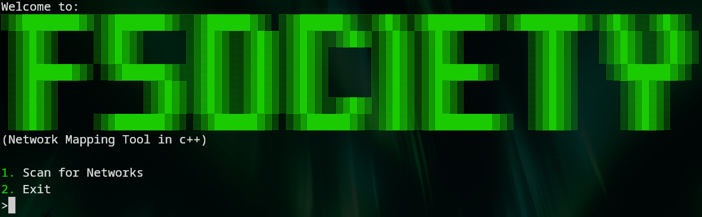

# fsociety
Network Mapping Tool programmed in C++.
> [!WARNING]
> Hello Skid! Only use this Script against your own WiFi and Devices.   

## Install:
  ### 1. Clone Repo:
    git clone https://github.com/thePortal362/fsociety
  ### 2. Change Dir:
    cd fsociety
  ### 3. Compile:
    g++ main.cpp -o main
  ### 4. Run:
    ./main

#### Go watch MR. Robot.
